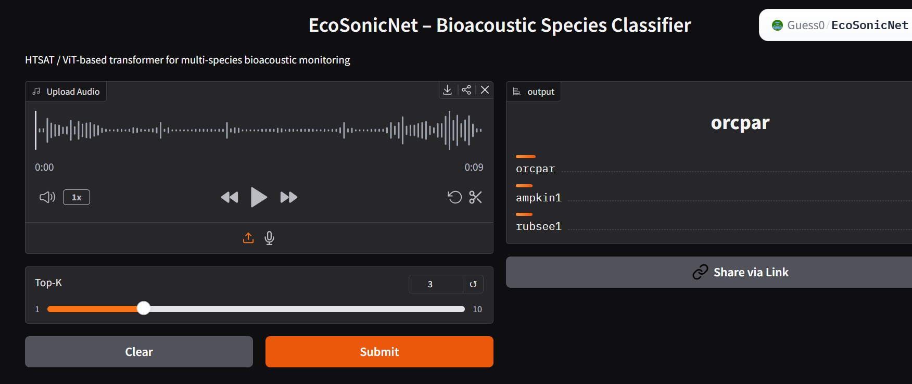

# 🌿 EcoSonicNet — Bioacoustic Species Classifier  

EcoSonicNet is an **end-to-end bioacoustic AI system** that classifies species from environmental audio recordings using a **Vision Transformer (ViT)**-based architecture, deployed as a **full-stack web application (React + Flask)**.

Inspired by real-world **biodiversity monitoring and passive acoustic sensing systems**, this project enables users to upload audio recordings and obtain **Top-K species predictions**, along with **confidence scores and taxonomy metadata**.

---

## 🚀 Live Deployment  

The model is deployed as an interactive web application using Hugging Face Spaces, enabling **real-time inference without local setup**.

🔗 Live Demo (App UI): https://guess0-ecosonicnet.hf.space  
🔗 Hugging Face Space: https://huggingface.co/spaces/Guess0/EcoSonicNet  

> Note: The Hugging Face deployment uses a Gradio-based interface for inference, while this repository contains the full React + Flask implementation for local and extensible use.

---

## 📸 Screenshots  

### Web App Interface  


---

## 📊 Results & Impact  

- Achieved **70% validation accuracy** on BirdCLEF dataset  
- Supports **206 species classification** (birds, amphibians, mammals, insects)  
- Tested on **real-world environmental soundscapes**  
- Provides **Top-K predictions with confidence scores**  
- Real-time inference via web interface (~1–2 seconds per prediction on CPU)  

---

## 🧠 Why This Project is Unique  

- Uses **Vision Transformers (ViT)** instead of traditional CNNs for audio classification  
- Applies **computer vision techniques to bioacoustic signals** (mel-spectrogram as image)  
- Incorporates **taxonomy-aware predictions** (common name, scientific name, class)  
- Built as a **complete ML + full-stack system**, not just a standalone model  
- Inspired by **real-world ecological monitoring systems**  

---

## 🧩 System Architecture 
User Audio Upload
↓
Audio Preprocessing (Resample → Mel Spectrogram)
↓
224×224 Spectrogram Image
↓
Vision Transformer (ViT / HTSAT-style model)
↓
Softmax Predictions (206 classes)
↓
Flask API (Inference + Processing)
↓
React Frontend (Visualization)
↓
Top-K Species + Confidence + Taxonomy


---

## 📂 Dataset  

- **Source:** BirdCLEF 2025 (Kaggle Competition)  
  https://www.kaggle.com/competitions/birdclef-2025  

- **Data Type:** Environmental bioacoustic recordings  
- **Sources:** Xeno-canto, iNaturalist, Colombian Sound Archive  
- **Sampling Rate:** 32 kHz  
- **Classes:** 206 species  

Includes:
- Short labeled audio clips (`train_audio/`)  
- Long soundscape recordings (`train_soundscapes/`, `test_soundscapes/`)  
- Metadata (`train.csv`, `taxonomy.csv`)  

---

## ⚙️ Tech Stack  

- **Frontend:** React (Vite)  
- **Backend:** Flask  
- **ML Framework:** PyTorch + timm  
- **Model:** Vision Transformer (ViT / HTSAT-inspired)  
- **Deployment:** Hugging Face Spaces  

---

## 📁 Project Structure 
EcoSonicNet/
│
├── best_model.pth # Trained model weights (206 classes)
├── train.csv # Training metadata
├── taxonomy.csv # Taxonomy metadata
│
├── backend/
│ ├── app.py # Flask API
│ └── inference.py # Preprocessing + model inference
│
├── frontend/
│ ├── src/App.jsx # UI logic
│ └── vite.config.js # API proxy


---

## 🤖 ML Model Overview  

- **Architecture:** Vision Transformer (ViT-B/16, HTSAT-inspired)  
- **Input:** 224×224 mel-spectrogram  
- **Output:** Softmax probabilities over 206 species  
- **Framework:** PyTorch + timm  
- **Device:** CPU-compatible  

### Model Insight  
The model treats audio as a **2D visual representation (spectrogram)** and uses attention mechanisms to capture **temporal-frequency dependencies**, improving classification of complex environmental sounds.

---

## 🎧 Audio Preprocessing  

Implemented in `backend/inference.py`:

- Resample to **32 kHz**  
- Generate **mel spectrogram**:
  - `n_fft = 1024`
  - `hop_length = 320`
  - `n_mels = 224`
- Convert to **dB scale**  
- Normalize using mean/std  
- Pad/crop to shape:
  (1, 1, 224, 224)


---

## 🧬 Label Mapping & Taxonomy  

### Class Index Mapping  
- Extract unique labels from `train.csv`  
- Sort deterministically  
- Map index → species label  

### Taxonomy Enrichment  
Predictions are enriched with:
- Common name  
- Scientific name  
- Class (Aves, Mammalia, Amphibia, Insecta)  

---

## 🌐 Backend API (Flask)  

### GET `/api/health`  
Returns:
- status  
- number of classes  
- model path  

### POST `/api/predict`  

**Request:**
- Audio file (`.wav`, `.mp3`, `.ogg`, etc.)  
- Optional: `top_k` (default = 5)  

**Response:**
- Top-K predictions  
- Confidence scores  
- Taxonomy details  

> Backend always returns JSON (even on error) for frontend stability.

---

## ▶️ Run Locally  

bash
# Clone repo
git clone https://github.com/SamriddhiGanguly05/EcoSonicNet.git
cd EcoSonicNet

# Backend setup
cd backend
pip install -r requirements.txt
python app.py

# Frontend setup
cd ../frontend
npm install
npm run dev


  

## Pretrained Model

Due to GitHub file size limits, the trained model weights are provided via **GitHub Releases**.

Download:
https://github.com/SamriddhiGanguly05/EcoSonicNet/releases

After downloading, place the file in the project root directory:

```text
best_model.pth
